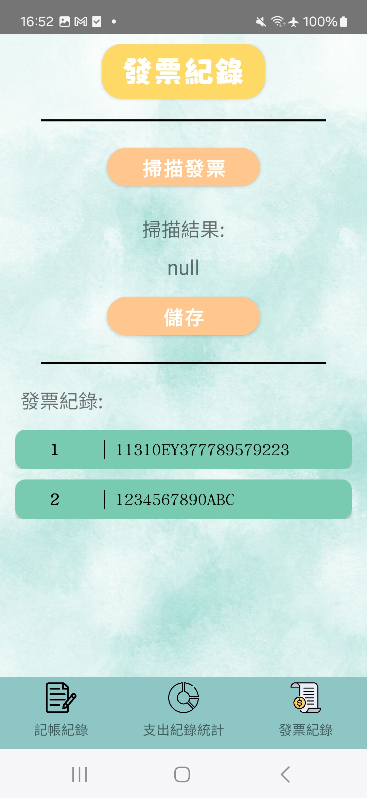

Android 簡易記帳APP
-------------

1. 資料庫使用Firebase
2. 紀錄統計使用圓餅圖
3. 掃描QRcode功能

| 首頁 | 註冊 |
| :----: | :----: |
|  | |

| 記帳紀錄 | 設定預算 |
| :----: | :----: |
|  | |

| 支出記錄統計 | 發票紀錄 |
| :----: | :----: |
|  | |
